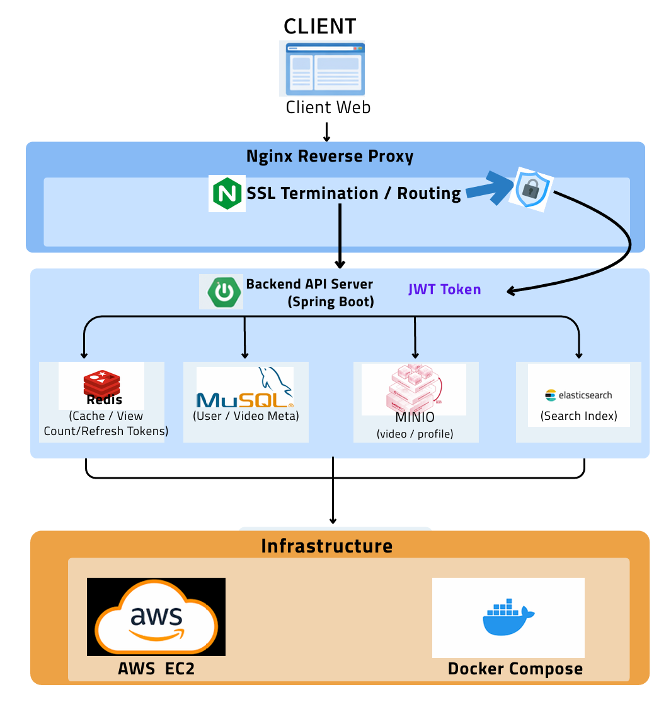

# 🎬 YouTube-like Video Platform

대용량 영상 업로드 · 검색 · 조회수 랭킹 기능을 갖춘  
**Spring Boot 기반 미디어 플랫폼 프로젝트**

개인 단독 개발 프로젝트로  
백엔드 API, 검색 시스템, 캐싱, 인프라까지 전체 구조를 직접 설계했습니다.

---

# 📌 Project Overview

YouTube와 유사한 구조의 영상 플랫폼을 설계한 프로젝트입니다.

영상 업로드, 검색, 조회수 처리 등 실제 서비스 수준의 요구사항을 가정하고  
검색엔진, 캐싱, 오브젝트 스토리지, 인프라 전반을 직접 구축했습니다.

### 주요 목표

- 대용량 영상 업로드 및 저장 구조 설계
- Elasticsearch 기반 고속 검색 시스템 구현
- Redis 기반 실시간 조회수 처리 및 랭킹 계산
- AWS EC2 + Docker Compose 기반 서비스 인프라 구축
- 실제 서비스 환경을 가정한 트러블 슈팅 경험 확보

---
# 🏢  Architecture

  

---

# 🛠 Tech Stack

## Backend
- Java
- Spring Boot
- Spring Security
- JPA

## Database
- MySQL

## Cache
- Redis

## Search
- Elasticsearch

## Storage
- MinIO (Object Storage)

## Infrastructure
- AWS EC2
- Docker Compose
- Nginx

---

# 🏗 System Architecture

Client
↓
Nginx Reverse Proxy
↓
Spring Boot API Server
↓
Redis (Cache / View Count)
MySQL (User / Video Metadata)
Elasticsearch (Search Index)
MinIO (Video Storage)

### 주요 구성

- **Nginx**
  - Reverse Proxy
  - SSL Termination
  - Routing

- **Spring Boot**
  - REST API 서버
  - JWT 인증 처리
  - Video / User 관리

- **Redis**
  - 조회수 증가 처리
  - 인기 영상 랭킹 계산
  - Refresh Token 저장

- **Elasticsearch**
  - 영상 검색
  - 자동완성 기능

- **MinIO**
  - 영상 파일 저장
  - Object Storage 역할

---

# ✨ Core Features

## 1️⃣ Authentication / User Management

- 회원가입
- 로그인
- JWT 기반 인증 / 인가
- 인증이 필요한 API 보호

---

## 2️⃣ Video Upload & Management

- 대용량 영상 업로드 처리
- 영상 메타데이터 관리
  - 제목
  - 설명
  - 태그
  - 카테고리
- MinIO 기반 영상 파일 저장

---

## 3️⃣ Video Search

- Elasticsearch 기반 검색
- 제목 / 태그 / 카테고리 검색 지원
- Nori Analyzer 적용
- Suggest API 기반 자동완성

---

## 4️⃣ View Count & Ranking

- Redis 기반 조회수 증가 처리
- Redis Sorted Set 기반 인기 영상 랭킹 계산
- 일정 주기마다 MySQL에 반영

---

# 🔧 Trouble Shooting

## 대용량 영상 업로드 문제

### 문제

- Nginx 및 Backend 요청 크기 제한
- 업로드 시 메모리 사용량 증가

### 해결

- Nginx `client_max_body_size` 설정
- Spring Multipart 설정 최적화
- **Streaming 방식으로 MinIO 업로드**

---

## 검색 품질 문제

### 문제

- 기본 Analyzer 사용 시 한국어 검색 정확도 부족

### 해결

- Elasticsearch **Nori Analyzer 적용**
- Suggest API 기반 자동완성 구현
- 태그 / 카테고리 기반 검색 필터링

---

## 조회수 처리 부하 문제

### 문제

- 조회수를 DB에서 직접 처리 시 부하 발생

### 해결

- Redis 캐시 사용
- 배치 작업으로 MySQL 반영
- Redis Sorted Set으로 랭킹 계산

---

# 🚀 Deployment

### Infrastructure

- AWS EC2
- Docker Compose
- Nginx Reverse Proxy
- SSL 적용

---

# 📷 Screenshots

###홈페이지

  

---

# 🔗 Links

### GitHub

https://github.com/jungsoonman/video-project

### Service

http://www.vidsparkkr.online

---

